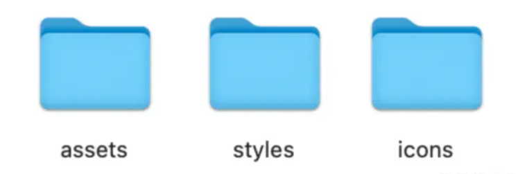

# iHRM人资后台管理

## 1、项目初始化

**拉取代码**

```bash
git clone https://github.com/PanJiaChen/vue-admin-template.git heimahr
```

**升级 core-js 版本到 3.25.5**

```json 
// package.json
"core-js": "3.6.5",// [!code --]
"core-js": "3.25.5",// [!code ++]
```      

**基础设置 settings.js**

```js
// settings.js
module.exports = {
  title: 'Vue Admin Template',// [!code --]
  title: 'iHRM人力资源后台管理系统',// [!code ++]

  fixedHeader: false,// [!code --]
  fixedHeader: true,// [!code ++]

  sidebarLogo: false// [!code --]
  sidebarLogo: true// [!code ++]
}
```  

**导入样式资源并使用 git 管理**



```bash
git init
git remote add origin https://github.com/csheng-github/heimahr.git
git branch -M main
git push -u origin main
```  

